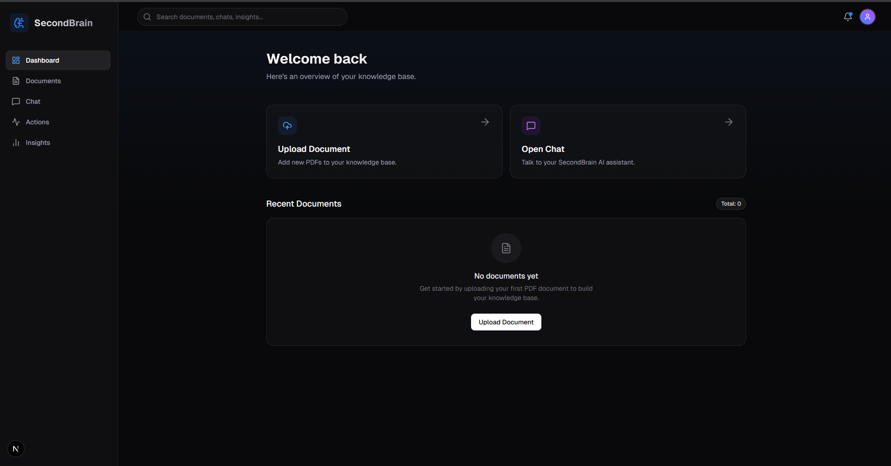
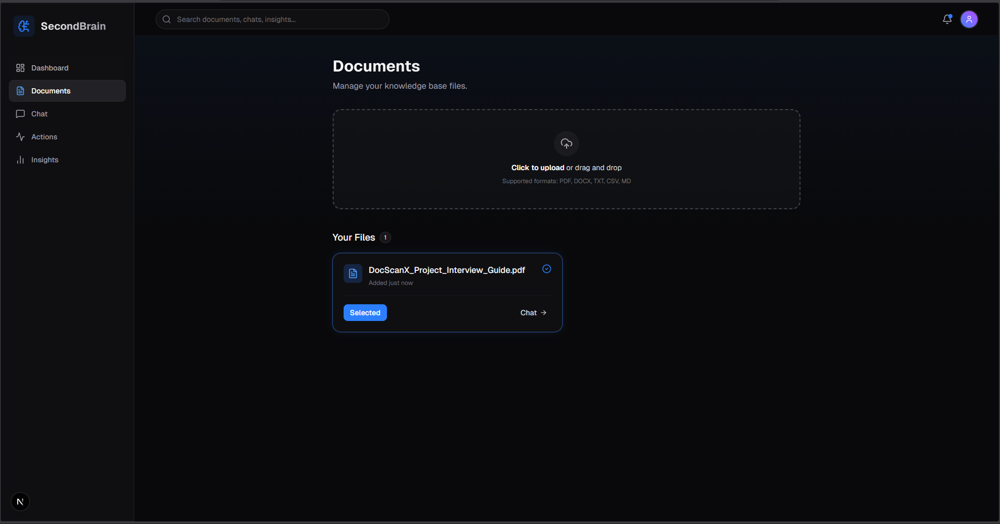
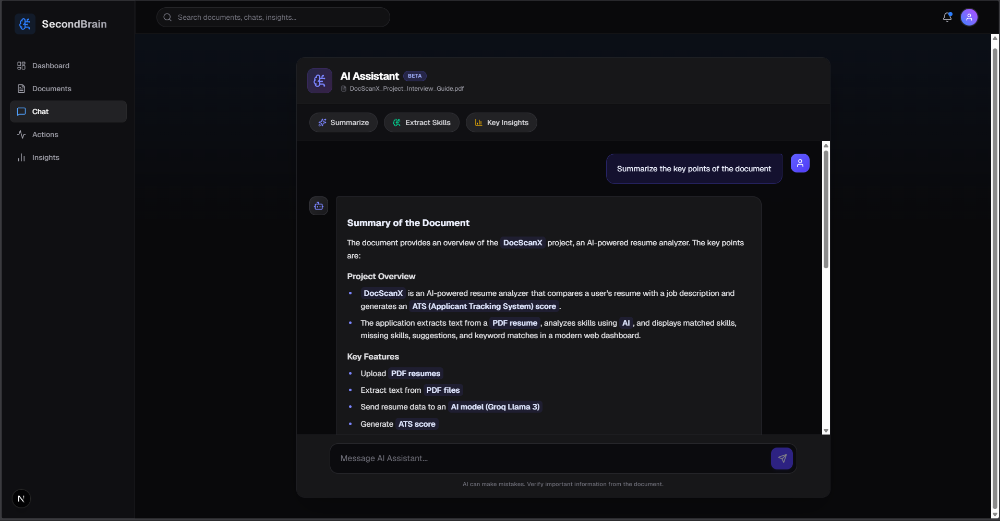
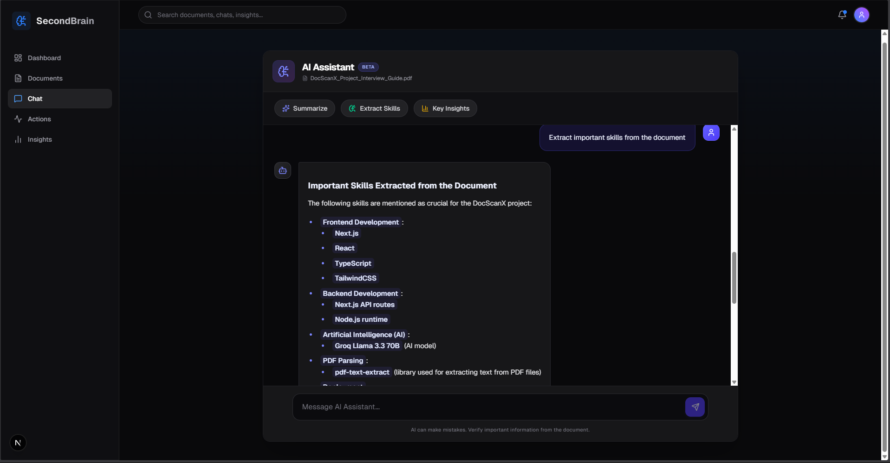
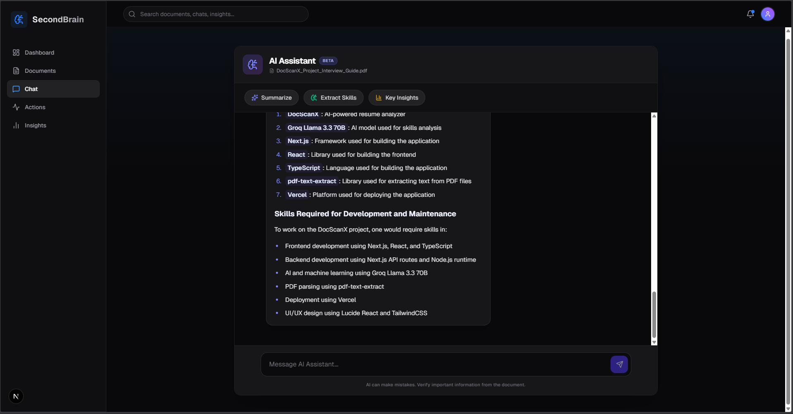

# 🧠 SecondBrain — AI Document Assistant

> Turn your documents into an interactive AI-powered knowledge system.

SecondBrain is a full-stack AI application that allows users to upload documents and interact with them using natural language queries. It delivers **real-time streaming responses**, **context-aware answers**, and **source attribution** for transparency.

---

## 🚀 Live Demo
👉 (Add your deployed link here after Vercel)

---

## ✨ Key Features

- 📄 **Document Upload** — Upload PDFs and extract content instantly  
- 💬 **AI Chat Interface** — Ask questions about your documents  
- ⚡ **Streaming Responses** — ChatGPT-like real-time typing effect  
- 🧠 **Context Filtering** — Only relevant document chunks are used  
- 📌 **Source Attribution** — Shows where answers come from  
- 🗂️ **Per-Document Memory** — Separate chat history per file  

---

## 🖼️ Screenshots

### 📄 Upload & Document Handling


### 💬 upload interface


### ⚡ Streaming AI Response


### 📌 Ai Response 


### 🧠 AI Insights Key Output


---

## 🏗️ Tech Stack

### Frontend
- Next.js (App Router)
- Tailwind CSS
- Zustand (state management)

### Backend
- Node.js
- Express.js
- Multer (file upload)

### AI Integration
- Groq API (LLM inference)

---

## 🧠 How It Works

1. User uploads a document  
2. Backend extracts text from file  
3. Text is split into smaller chunks  
4. Relevant chunks are selected based on query  
5. AI generates a response using selected context  
6. Response is streamed word-by-word to UI  
7. Sources are attached to improve reliability  

---

## ⚙️ Installation

```bash
git clone https://github.com/MaximuxR93/SecondBrain.git
cd SecondBrain
